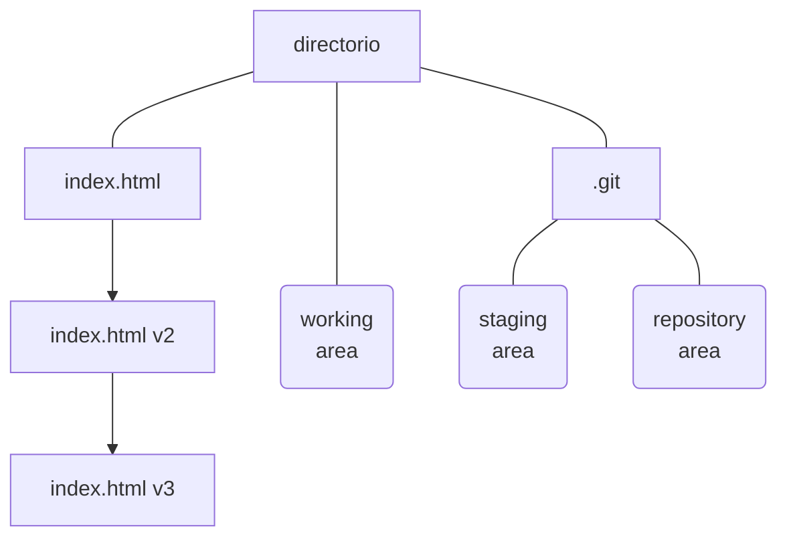
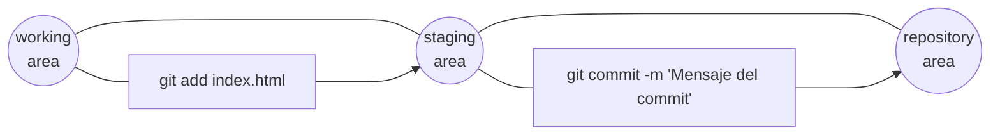

# Git
Git es un sistema de control de versiones distribuido, que permite gestionar el código fuente de un proyecto.
Un programa cambia con el tiempo. A medida que se añaden nuevas características, se corrigen errores y se mejoran las funcionalidades, el código fuente del programa va cambiando. Un sistema de control de versiones permite gestionar estos cambios, y mantener un historial de los cambios que se han realizado en el código fuente del programa.

Os evitará muchos dolores de cabeza, sin esto podeis terminar con código que no funciona, y no saber por qué ni cómo arreglarlo.

Te permite trabajar sin miedo a romper el código, a tenerlo disponible en cualquier ordenador y a trabajar colaborativamente en proyectos grandes sin romperos el codigo entre varios.

Por defecto, git es una herramienta de línea de comandos, pero existen muchas herramientas gráficas que facilitan su uso, vscode incluye una integracion con repositorios locales y remotos, asi que no tendrás mucho problema, pero es necesario sentirse comodo con la linea de comandos y git, por suerte, solo son unos cuantos comandos (really) para empezar a trabajar.

## Instalación
Para instalar Git en nuestro ordenador, podemos descargarlo desde la página oficial de Git: https://git-scm.com/downloads

Una vez instalado, podemos comprobar que se ha instalado correctamente ejecutando `git --version` en la terminal.

# Configurar usuario y email
Antes de empezar a usar Git, es necesario configurar el nombre de usuario y el email, para que Git sepa quién es el autor de los cambios que se realicen en el repositorio.

```bash
git config --global user.name datadiego
git config --global user.email juandiegomariscal@gmail.com
```
# Que es git
A efectos practicos, cuando iniciamos un repositorio en una carpeta, git crea una carpeta oculta llamada .git, en la que guarda toda la información necesaria para gestionar los cambios en el código fuente del proyecto.

La carpeta .git puede abstraerse en 3 partes:
- **Área de preparación**: es un área donde se guardan los archivos que han sido modificados, añadidos o eliminados, y que están listos para ser guardados en el repositorio.
- **Repositorio local**: es un repositorio donde se guardan los cambios que se han realizado en el código fuente del proyecto.
- **Repositorio remoto**: es un repositorio remoto donde se guardan los cambios que se han realizado en el repositorio local.

Esto nos permite disponer de varias versiones con los cambios que hemos ido haciendo:



# Workflow
El flujo de trabajo de Git es muy sencillo.
Primero, debemos inicializar un repositorio en el directorio donde se encuentra el código fuente del proyecto. Para ello, ejecutamos `git init` en la terminal.

Una vez inicializado el repositorio, podemos empezar a trabajar en el proyecto. Cuando hayamos realizado cambios en el código fuente, podemos guardar los cambios en el repositorio ejecutando `git add .` para añadir todos los archivos modificados al área de preparación, y `git commit -m "Mensaje del commit"` para guardar los cambios en el repositorio.



Si tenemos un repositorio remoto, podemos sincronizar los cambios ejecutando `git push` para enviar los cambios al repositorio remoto, y `git pull` para descargar los cambios del repositorio remoto.

# Comandos básicos

## `git config`
El comando `git config` se utiliza para configurar Git. Con este comando podemos configurar el nombre de usuario y el email, así como otras opciones de configuración.

## `git init`
El comando `git init` se utiliza para inicializar un repositorio en el directorio actual. Este comando crea un directorio oculto llamado `.git` donde se almacena la información del repositorio.

## `git add`
El comando `git add` se utiliza para añadir archivos al área de preparación. Este comando añade los archivos al área de preparación, pero no los guarda en el repositorio.

## `git commit`
El comando `git commit` se utiliza para guardar los cambios en el repositorio. Este comando guarda los cambios en el repositorio, pero no los envía al repositorio remoto.

## `git status`
El comando `git status` se utiliza para ver el estado del repositorio. Este comando muestra los archivos que han sido modificados, añadidos o eliminados, y que están listos para ser guardados en el repositorio.

## `git log`
El comando `git log` se utiliza para ver el historial de cambios del repositorio. Este comando muestra una lista de los commits que se han realizado en el repositorio, con información sobre el autor, la fecha y la hora, y el mensaje del commit.

## `git checkout`
El comando `git checkout` se utiliza para cambiar de rama. Este comando cambia de rama, y actualiza el directorio de trabajo con los archivos de la rama seleccionada.

## `git clone`
El comando `git clone` se utiliza para clonar un repositorio remoto. Este comando crea una copia local de un repositorio remoto.

## `git push`
El comando `git push` se utiliza para enviar los cambios al repositorio remoto. Este comando envía los cambios al repositorio remoto, y actualiza el repositorio remoto con los cambios realizados en el repositorio local.

## `git pull`
El comando `git pull` se utiliza para descargar los cambios del repositorio remoto. Este comando descarga los cambios del repositorio remoto, y actualiza el repositorio local con los cambios realizados en el repositorio remoto.

## `git branch`
El comando `git branch` se utiliza para crear, eliminar y listar ramas. Este comando crea una nueva rama, elimina una rama existente, y lista las ramas existentes.